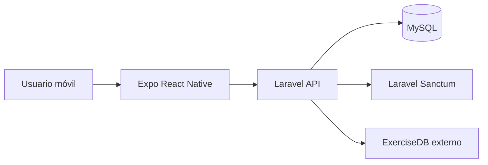
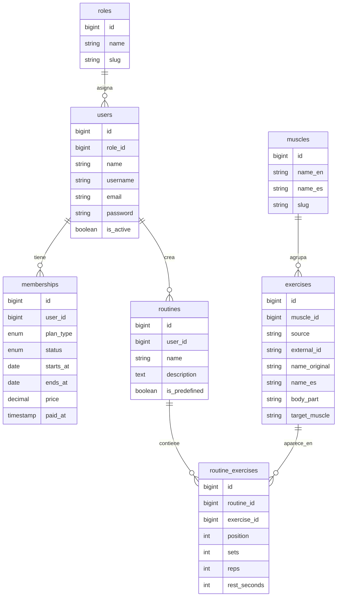
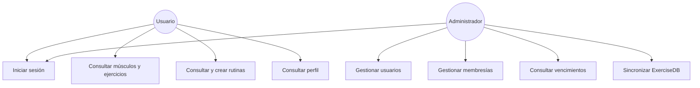
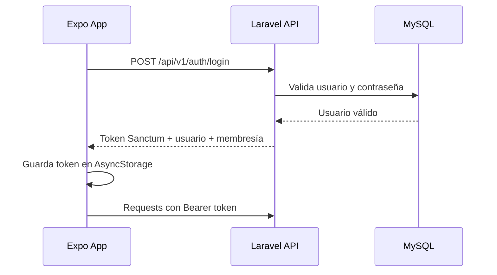

# Arquitectura y diagramas

## Arquitectura general

```mermaid
flowchart LR
  User[Usuario móvil] --> Expo[Expo React Native]
  Expo --> Api[Laravel API]
  Api --> MySQL[(MySQL)]
  Api --> Sanctum[Laravel Sanctum]
  Api --> ExerciseDB[ExerciseDB externo]
```

## ERD

```mermaid
erDiagram
  roles ||--o{ users : asigna
  users ||--o{ memberships : tiene
  users ||--o{ routines : crea
  muscles ||--o{ exercises : agrupa
  routines ||--o{ routine_exercises : contiene
  exercises ||--o{ routine_exercises : aparece_en

  roles {
    bigint id
    string name
    string slug
  }

  users {
    bigint id
    bigint role_id
    string name
    string username
    string email
    string password
    boolean is_active
  }

  memberships {
    bigint id
    bigint user_id
    enum plan_type
    enum status
    date starts_at
    date ends_at
    decimal price
    timestamp paid_at
  }

  muscles {
    bigint id
    string name_en
    string name_es
    string slug
  }

  exercises {
    bigint id
    bigint muscle_id
    string source
    string external_id
    string name_original
    string name_es
    string body_part
    string target_muscle
  }

  routines {
    bigint id
    bigint user_id
    string name
    text description
    boolean is_predefined
  }

  routine_exercises {
    bigint id
    bigint routine_id
    bigint exercise_id
    int position
    int sets
    int reps
    int rest_seconds
  }
```

## Casos de uso

```mermaid
flowchart TB
  Usuario((Usuario))
  Admin((Administrador))

  Usuario --> Login[Iniciar sesión]
  Usuario --> Catalogo[Consultar músculos y ejercicios]
  Usuario --> Rutinas[Consultar y crear rutinas]
  Usuario --> Perfil[Consultar perfil]

  Admin --> Login
  Admin --> Usuarios[Gestionar usuarios]
  Admin --> Membresias[Gestionar membresías]
  Admin --> Vencimientos[Consultar vencimientos]
  Admin --> Sync[Sincronizar ExerciseDB]
```

## Flujo de login

```mermaid
sequenceDiagram
  participant App as Expo App
  participant API as Laravel API
  participant DB as MySQL

  App->>API: POST /api/v1/auth/login
  API->>DB: Valida usuario y contraseña
  DB-->>API: Usuario válido
  API-->>App: Token Sanctum + usuario + membresía
  App->>App: Guarda token en AsyncStorage
  App->>API: Requests con Bearer token
```
